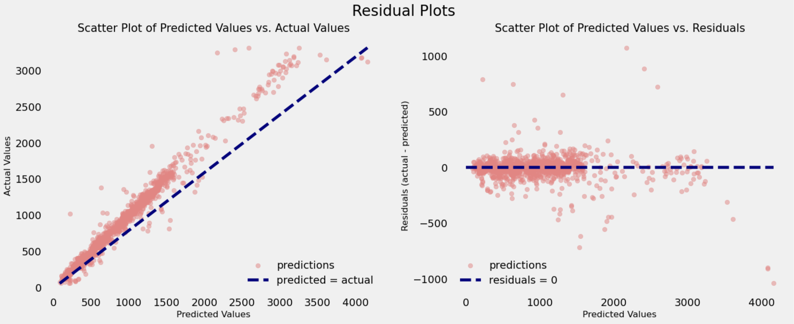
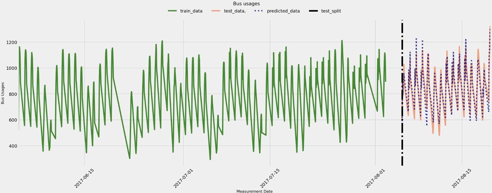

# 🚌 Bus Usage Forecasting

[](LICENSE)
[](https://www.python.org/)
[](https://jupyter.org/)


Time series forecasting of hourly bus usage across 9 municipalities using machine learning models. This project involves data preprocessing, exploratory data analysis, baseline modeling, feature engineering, and advanced modeling techniques to predict bus usage patterns.

## 📊 Project Overview

This project aims to forecast hourly bus usage for 9 different municipalities. The dataset includes timestamps, usage counts, and total capacity for each municipality. The forecasting process encompasses:

- 📥 **Data Reading and Preprocessing**: Handling missing values and aggregating measurements
- 📊 **Exploratory Data Analysis (EDA)**: Understanding usage patterns and trends
- 🧪 **Baseline Predictions**: Implementing simple models for initial benchmarks
- 🕰️ **Feature Generation**: Creating time-based features to enhance model performance
- ⚙️ **Hyperparameter Tuning**: Optimize parameters of machine learning model to achieve the best result
- 🤖 **Advanced Modeling**: Utilizing machine learning models for accurate forecasting

## 🚀 Getting Started

### Prerequisites

- Python 3.x
- Jupyter Notebook

### Installation

1. **Clone the repository**:
   ```bash
   git clone https://github.com/davutbayik/bus-usage-forecasting.git
   cd bus-usage-forecasting

2. Create and activate a virtual environment (Optional-Recommended):
   ```bash
   python -m venv .venv
   source .venv/bin/activate  # On Windows: .venv\Scripts\activate

3. Install the required packages:
   ```bash
   pip install -r requirements.txt

4. Launch the Jupyter Notebook
   ```bash
   jupyter notebook bus_forecasting.ipynb

## 🧪 Methodology

- **Data Aggregation**: Combined bi-hourly measurements into hourly data using the maximum value to represent bus usage per hour.
- **Missing Data Handling**: Applied interpolation techniques to address missing values in the dataset.
- **Feature Engineering**: Extracted features such as hour of the day, day of the week, and municipality ID.
- **Modeling**:
  - *Baseline*: Implemented a naive linear regression model predicting the previous hour's usage.
  - *Tune Parameters*: Apply grid search over hyperparameters to optimize scores.
  - *Advanced*: Employed XGBoost regression for improved accuracy.

## 📄 Dataset Description

The dataset used in this project is designed to analyze and forecast bus usage across 9 municipalities. It includes time series data with the following columns:

### 🧾 Columns

| Column Name      | Description                                                   |
|------------------|---------------------------------------------------------------|
| `MUNICIPALITY_ID`| Identifier for each municipality (ranging from 0 to 8)        |
| `TIMESTAMP`      | Date and time of the measurement                              |
| `USAGE`          | Number of buses in use at the given timestamp                 |
| `TOTAL_CAPACITY` | Total number of buses available in the municipality           |

### 🕒 Time Series Nature

- Measurements are taken **twice per hour**.
- To transform the data into a true **hourly time series**, the two entries per hour are aggregated by taking the **maximum value** for each hour. This approach ensures we capture the peak usage per hour.

### 🧼 Preprocessing Steps

1. **Datetime Parsing**: Convert `TIMESTAMP` to a proper datetime format.
2. **Resampling**: Aggregate to hourly data using `max()` for `USAGE` and `TOTAL_CAPACITY`.
3. **Missing Data Handling**: Applied time-based interpolation to fill in missing timestamps or values.
4. **Municipality-wise Separation**: Data can be grouped and analyzed by individual `MUNICIPALITY_ID`.

### 📍 Example Entry

| MUNICIPALITY_ID | TIMESTAMP           | USAGE | TOTAL_CAPACITY |
|------------------|---------------------|--------|------------------|
| 3                | 2023-07-01 10:00:00 | 45     | 60               |

### 📌 Notes

- The dataset is suitable for both **univariate** and **multivariate** time series forecasting.
- Each municipality's data can be modeled independently or combined using advanced techniques.
- Proper time-based feature extraction (e.g., hour, day, weekday) enhances model performance.

### 📦 Source

The dataset was obtained from [Kaggle](https://www.kaggle.com/datasets/berkantaslan/municipality-bus-utilization) or other public sources and prepared specifically for machine learning experiments related to public transportation optimization.

## 📈 Model Performance

To assess how well XGBoost regressor predicts the future bus usages, we evaluated the the model using:

- **Root Mean Squared Error (RMSE)**: Indicates how far predictions deviate from actual values. (Lower the better)
- **R-squared (R² Score)**: Explains how much variance in the target is captured by the model. (Higher the better)

- **Findings**:
  - The XGBoost model outperformed the baseline, capturing complex patterns in bus usage.
  - Feature importance analysis highlighted the significance of time-based features.

## ✅ Model Comparison

| Model             | RMSE     | R² Score |
|------------------ |------------|--------|
| Linear Regression | 427.05   | 0.5196   |
| XGBoost Regressor | **111.1657** | **0.9674**   |

## 📉 Example Results

The image below shows how the residuals are distributed along the actual values by the best regressor.



The image below shows how well the model predicted the test set by overlapping the actual usage values and predictions



## 🤝 Contributing

Contributions are welcome and appreciated! If you’d like to improve this project, here’s how you can help:

- 🐞 Report bugs or issues.
- 🌟 Suggest new features or improvements.
- 🔀 Fork the repo, make your changes, and submit a pull request.

Please make sure your code follows best practices and includes proper documentation where necessary.

## 📄 License

This project is licensed under the terms of the [MIT License](LICENSE).  
You are free to use, modify, and distribute this software as long as you include the original license.

## 📬 Contact

Made with ❤️ by [Davut Bayık](https://github.com/davutbayik) — feel free to reach out via GitHub for questions, feedback, or collaboration ideas.

---

⭐ If you found this project helpful, consider giving it a star!
